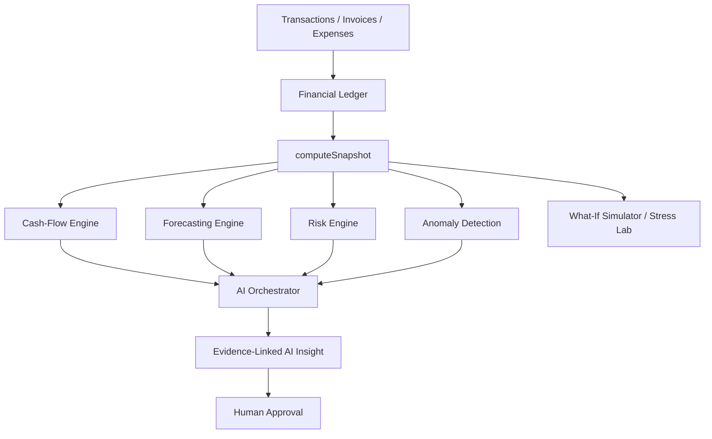

# TrustLedger

### Turn business activity into financial intelligence.

TrustLedger is a working financial intelligence platform for small
businesses: it turns fragmented transactions, invoices, and expenses into a
coherent model of cash flow, risk, and forecasted runway — and lets an
owner simulate a decision before making it.

> **Decision-support / demonstration only.** TrustLedger uses synthetic
> data, moves no real money, and makes no lending or compliance decisions.
> See [Disclaimer](#disclaimer).

---

## The Problem

A business owner knows *"I made ₹8 lakh this month."* They usually don't
know how much of that is actually available to spend, which customers are
paying late, whether supplier costs are quietly eating their margin, or
whether a cash shortfall is 20 days away. That information exists — spread
across transactions, invoices, and expenses — it's just never assembled.

## The Solution

```
RAW BUSINESS ACTIVITY -> NORMALIZATION -> FINANCIAL GRAPH -> ANALYTICS & FORECASTING
   -> RISK ENGINE -> AI EXPLANATION -> WHAT-IF SIMULATION -> BUSINESS DECISION
```

Every number on every screen traces back to one function,
`computeSnapshot()`, that turns the raw ledger into cash flow, receivables/
payables aging, concentration, forecasts, anomalies, a deterministic risk
score, and a deterministic financial health score — see
[docs/architecture.md](docs/architecture.md).

## Core Architecture



## Financial Graph

An interactive [React Flow](https://reactflow.dev) graph
(`/financial-graph`) rendering the business's accounts, top customers, and
top suppliers as nodes, with edges for who pays whom. Click any node for
its detail.

## Risk Engine

Six deterministic, documented risk categories (liquidity, revenue, expense,
receivables, concentration, anomaly), each scored from named factors with
fixed, configurable weights — see [docs/risk-engine.md](docs/risk-engine.md).
Nothing here is AI-generated; every score is reproducible from the same
inputs.

## Forecasting

A damped Holt's-method forecaster with day-of-week seasonality, chosen for
explainability over raw accuracy. Confidence bands are computed from actual
backtested residuals, not invented. Full write-up and **measured** accuracy
(including where it breaks down over longer horizons):
[docs/forecasting.md](docs/forecasting.md) /
[docs/forecast-evaluation.md](docs/forecast-evaluation.md).

## AI Financial Analyst

A multi-provider abstraction (Anthropic / OpenAI / Google / a deterministic
mock) with automatic fallback — **the app works fully with zero API keys
configured**. Every answer is a narration of a structured, deterministically
computed evidence block; the model never originates a number. See
[docs/ai-architecture.md](docs/ai-architecture.md).

## What-If Simulator & Stress Lab

Eleven what-if scenario types (hire staff, take a loan, lose your top
customer, ...) and six stress-test presets, all built on one pure
projection function that never mutates the production ledger — it always
compares a fresh baseline against a hypothetical. See
[docs/simulation-engine.md](docs/simulation-engine.md).

## Evidence-Based AI

Every `AIInsight` row is linked to the `EvidenceLink` rows (metrics, risks,
transactions) it was narrated from. The AI Analyst page renders these
alongside the answer so a claim is always traceable to a fact.

## Architecture Diagram

See [Core Architecture](#core-architecture) above and
[docs/architecture.md](docs/architecture.md) for the full data-flow diagram
and layering discipline (raw fact / classification / analysis / AI
interpretation / recommendation / human decision are always kept separate).

## Tech Stack

- **Framework**: Next.js 16 (App Router, Turbopack), React 19, TypeScript
- **Database**: SQLite for local dev via Prisma ORM (zero setup); schema is
  Postgres-compatible — see `docker-compose.yml`
- **UI**: Tailwind CSS v4, Recharts, [@xyflow/react](https://reactflow.dev),
  TanStack Query, Lucide icons
- **AI**: `@anthropic-ai/sdk` + hand-rolled OpenAI/Google REST clients
  behind one provider interface
- **Auth**: HMAC-signed session cookies (Web Crypto API), bcrypt password
  hashing, role-based access control
- **Testing**: Vitest (unit + integration), Playwright (E2E)

## Getting Started

```bash
git clone <this repo>
cd trustledger
npm install --legacy-peer-deps
cp .env.example .env
npx prisma migrate dev
npm run seed
npm run dev
```

Open http://localhost:3000 and sign in with any demo login shown on the
page (password `demo1234`).

To enable a real LLM instead of the deterministic mock narrator, set
`ANTHROPIC_API_KEY`, `OPENAI_API_KEY`, or `GOOGLE_API_KEY` in `.env` and
restart the dev server. Nothing else changes — the mock and every real
provider go through the same evidence-grounded narration path.

## Demo Data

`npm run seed` generates a synthetic business, **Nova Retail Systems**: 22
customers (one flagship, ~17% revenue concentration), 14 suppliers (one
dependency, ~20-33% of procurement), ~1,200 transactions and ~670 invoices
over 15 months, with deliberately built-in patterns — seasonality,
increasing payment delays and supplier cost inflation in the final months,
and 5 known-injected statistical anomalies (recorded in
`scripts/seed-ground-truth.json` for the anomaly evaluation). See
[docs/financial-domain-model.md](docs/financial-domain-model.md).

## API

REST endpoints under `/api/*` — see the route handlers in `src/app/api/`
for the authoritative list. Highlights:

```
POST /api/auth/login              GET  /api/dashboard
GET  /api/transactions             POST /api/transactions/import
GET  /api/customers/[id]           GET  /api/cashflow
GET  /api/forecast                 GET  /api/risk
GET  /api/anomalies                GET  /api/graph
POST /api/scenarios                POST /api/scenarios/[id]/run
GET  /api/stress-test              POST /api/ai/analyze
GET  /api/insights                 GET  /api/audit
```

Every route validates input with `zod`, checks the session and role, and
returns structured `{error: {code, message}}` on failure.

## Testing

```bash
npm test        # unit + integration (Vitest) — 31 tests
npm run e2e      # Playwright E2E (requires `npm run dev` running)
npm run typecheck
npm run lint
```

Unit tests cover every analytics engine (cash flow, forecast, runway,
receivables, anomaly, risk, health score, simulation/stress) against
concrete, hand-picked inputs. One integration test exercises the full
transaction -> ledger -> metrics -> risk -> AI insight -> audit chain
against a disposable SQLite database. Two Playwright E2E tests cover the
dashboard→cash-flow→risk-center path and the what-if simulator.

## Evaluation

Forecast accuracy, anomaly-detection precision/recall, and AI grounding
rate are all **measured**, not asserted — see
[docs/evaluation.md](docs/evaluation.md) and
[docs/forecast-evaluation.md](docs/forecast-evaluation.md) for the actual
numbers, methodology, and caveats (including where the forecaster's
accuracy degrades and why).

## Security

Session cookies, bcrypt password hashing, RBAC on every mutating route,
zod validation at every boundary, Prisma's parameterized queries. See
[docs/security.md](docs/security.md) and
[docs/threat-model.md](docs/threat-model.md) — including the honest gaps
(no rate limiting, no secret rotation) that would need addressing before
this went anywhere near production.

## Limitations

- Single-tenant-per-browser-session demo; no true multi-tenant isolation.
- Forecast accuracy degrades substantially beyond ~2-3 weeks (measured, see
  `docs/forecast-evaluation.md`) because it can't see pending
  receivables/payables that haven't converted to cash yet.
- Anomaly detection evaluation is against 5 deliberately extreme injected
  cases, not a large or subtle real-world corpus.
- Real-provider (non-mock) AI grounding has not been empirically measured
  in this repo — only the mock path has been evaluated.
- No rate limiting on any endpoint.
- Duplicate detection and rule-based categorization are heuristic, not
  exhaustive — both are explicitly designed for human review, not
  autonomous correction.

## Roadmap

- Feed known open receivables/payables into the forecaster instead of
  extrapolating from realized cash flow alone.
- Editable scenario assumptions in the What-If UI (currently defaults-only
  from the UI; the API already accepts custom assumptions).
- Real multi-tenant Postgres deployment with row-level security.
- Rate limiting + structured request logging for the AI and import routes.

## Disclaimer

TrustLedger is a research/demo prototype. It uses synthetic data, moves no
real money, executes no real financial transactions, and makes no
lending, credit, or compliance decisions. Any risk or health score shown is
decision-support only, explicitly labeled as such, and traceable to the
deterministic calculation that produced it — never presented as a
prediction of business failure.

---

🤖 Generated with [Claude Code](https://claude.com/claude-code)
