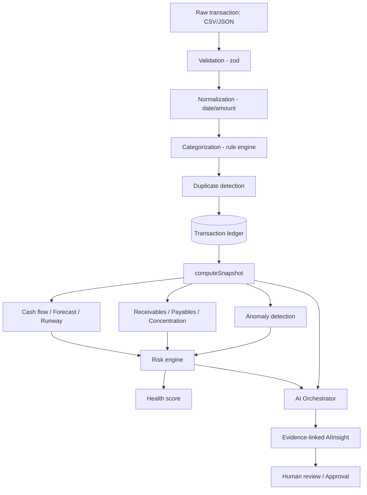

# Architecture

TrustLedger is a single Next.js 16 (App Router) application rather than the
`apps/web` + `apps/api` split sketched in the original brief — for a project
this size, one deployable with typed server actions/route handlers avoids a
cross-service contract to keep in sync, without losing any separation of
concerns. `packages/` becomes `src/lib/` with the same internal boundaries.

```
src/
  app/                   Next.js App Router
    (app)/               authenticated pages, wrapped in the sidebar Shell
    api/                 REST route handlers
    login/               unauthenticated
  components/            shared UI (Card, Badge, Sidebar, ...)
  lib/
    analytics/           pure, framework-free financial calculations
    ai/                  provider abstraction + orchestrator
    auth/                session cookie signing, RBAC
    pipeline/            transaction categorization + duplicate detection
    db/                  Prisma client singleton
prisma/                  schema + migrations
scripts/                 seed + evaluation scripts
tests/                   unit, integration, e2e
```

## Data flow



`computeSnapshot` (`src/lib/analytics/snapshot.ts`) is the single place that
turns raw ledger rows into every number the rest of the app displays —
dashboard, risk center, forecast page, and the AI orchestrator's evidence
all read from it, so a number never has two different computations behind
it depending on which screen you're looking at.

## Layering discipline (spec §34)

- **Raw fact**: `Transaction`, `Invoice`, `Expense` rows — what happened.
- **Classification**: `category`, `cashFlowClass`, `categorySource` on those
  same rows — how the system labeled it (rule engine or human correction).
- **Analysis**: everything in `src/lib/analytics/*` — deterministic,
  unit-tested, no LLM involved.
- **AI interpretation**: `AIInsight.detail` — a narration of the analysis
  layer's output, never a source of new numbers.
- **Recommendation / human decision**: `Approval` rows with a
  `SUGGESTED -> APPROVED|EDITED|REJECTED -> EXECUTED` status machine.

## What's simplified vs. the original brief

- One deployable app instead of a monorepo of `apps/*` + `packages/*`.
- SQLite for local dev (see `docker-compose.yml` for the Postgres path);
  the Prisma schema avoids SQLite-incompatible features so switching the
  datasource provider is the only change needed.
- RBAC is enforced in API route handlers (`src/lib/auth/rbac.ts`), not at
  the database row level (no Postgres RLS) — reasonable for a single-org
  demo, not something to carry into a multi-tenant production build.
